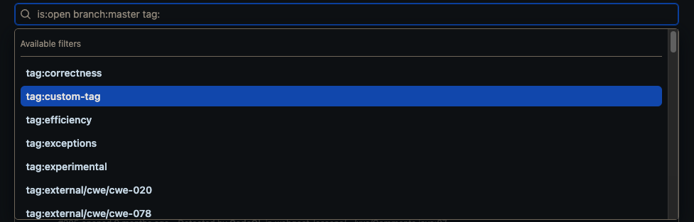

# tag-sarif

> ⛔️ This project has been withdrawn, since it does not function as intended

> ℹ️ This is an _unofficial_ tool created by Field Security Services, and is not officially supported by GitHub.

This script lets you filter results from different Code Scanning runs in the GitHub Security tab using a custom tag.

This is useful when dealing with monorepos that have code for several different projects in the same repository. You can use this tool to mark each project with a unique tag, and then filter the results in the GitHub Security tab to only show results for a specific project.

The SARIF is edited before upload to Code Scanning, applying one or more tags to each query/rule. The tags are attached to each Code Scanning result in the GitHub Security tab, and can be used to filter results in the web user interface:



It can run as a GitHub Action, or at the command-line.

## Example as an Action

> ⛔️ This project has been withdrawn, since it does not function as intended

We must modify an existing Code Scanning Actions workflow file to add the `tag-sarif` action, and add the literal tag `custom-tag` to each rule (and so to each result). You need to change that tag to something suitable for your use, such as a team name or a project name.

For example, if we are using the CodeQL action, we change the single `analyze` step from this:

```yaml
    - name: Perform CodeQL Analysis
      uses: github/codeql-action/analyze@v2
```

To:

```yaml
    - name: Perform CodeQL Analysis
      uses: github/codeql-action/analyze@v2
      with:
        upload: False
        output: sarif-results

    - name: Tag SARIF
      uses: advanced-security/tag-sarif@main
      with:
        tags: custom-tag
        input: sarif-results/${{ matrix.language }}.sarif
        output: sarif-results/${{ matrix.language }}.sarif
      
    - name: Upload SARIF
      uses: github/codeql-action/upload-sarif@v2
      with:
        sarif_file: sarif-results/${{ matrix.language }}.sarif
```

Note how we provided `upload: False` and `output: sarif-results` to the `analyze` action. That way we can edit the SARIF with the `tag-sarif` action before uploading it with the `upload-sarif` action.

> ⛔️ This project has been withdrawn, since it does not function as intended

A full example workflow is:

```yaml
name: "Tag SARIF"
on:
  push:
    branches: [main]

jobs:
  analyze:
    name: Analyze
    runs-on: ubuntu-latest

    strategy:
      fail-fast: false
      matrix:
        language: [ 'java' ]

    steps:
    - name: Checkout repository
      uses: actions/checkout@v3

    - name: Initialize CodeQL
      uses: github/codeql-action/init@v2
      with:
        languages: ${{ matrix.language }}

    - name: Autobuild
      uses: github/codeql-action/autobuild@v2

    - name: Perform CodeQL Analysis
      uses: github/codeql-action/analyze@v2
      with:
        upload: False
        output: sarif-results

    - name: Tag SARIF
      uses: advanced-security/tag-sarif@main
      with:
        tags: custom-tag
        input: sarif-results/${{ matrix.language }}.sarif
        output: sarif-results/${{ matrix.language }}.sarif

    - name: Upload SARIF
      uses: github/codeql-action/upload-sarif@v2
      with:
        sarif_file: sarif-results/${{ matrix.language }}.sarif

    - name: Upload SARIF results as a Build Artifact
      uses: actions/upload-artifact@v3
      with:
        name: sarif-results
        path: sarif-results
        retention-days: 1
```

In this full example we also attach the resulting SARIF file to the build as a Build Artifact, which is convenient for later inspection. You can remove this step if you don't need it.

## Example at the command-line

> ⛔️ This project has been withdrawn, since it does not function as intended

```python
python3 tag_sarif.py test.sarif --custom-tags example-tag --output-sarif test.sarif
```

## Requirements

* Python 3.6 or later
or
* GitHub Actions runner

## License

This project is licensed under the terms of the MIT open source license. Please refer to the [LICENSE](LICENSE) for the full terms.

## Maintainers

See [CODEOWNERS](CODEOWNERS) for the list of maintainers.

## Support

See the [SUPPORT](SUPPORT.md) file.

## Background

> ⛔️ This project has been withdrawn, since it does not function as intended

See the [CHANGELOG](CHANGELOG.md), [CONTRIBUTING](CONTRIBUTING.md), [SECURITY](SECURITY.md), [SUPPORT](SUPPORT.md), [CODE OF CONDUCT](CODE_OF_CONDUCT.md) and [PRIVACY](PRIVACY.md) files for more information.
